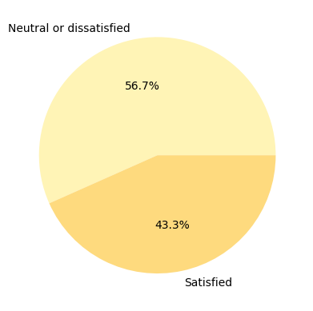
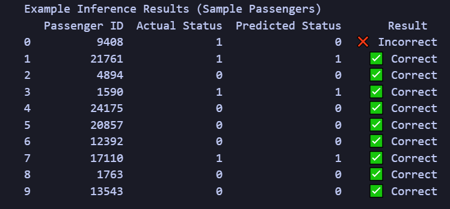
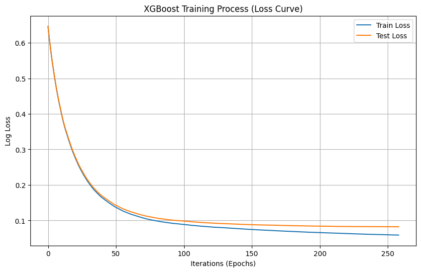
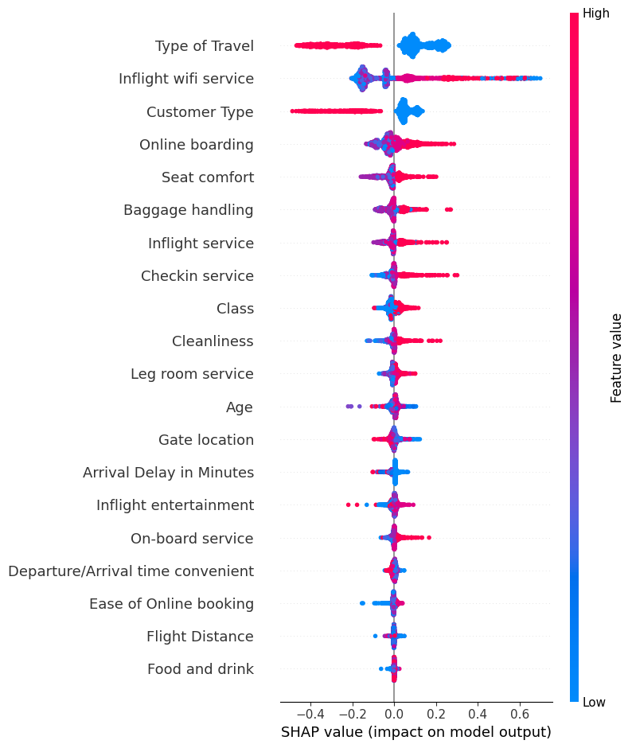
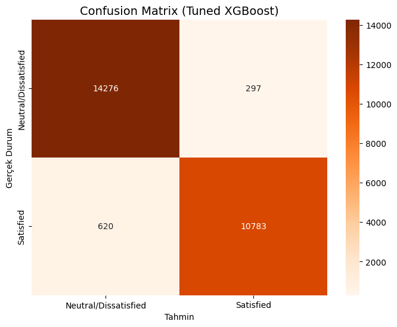
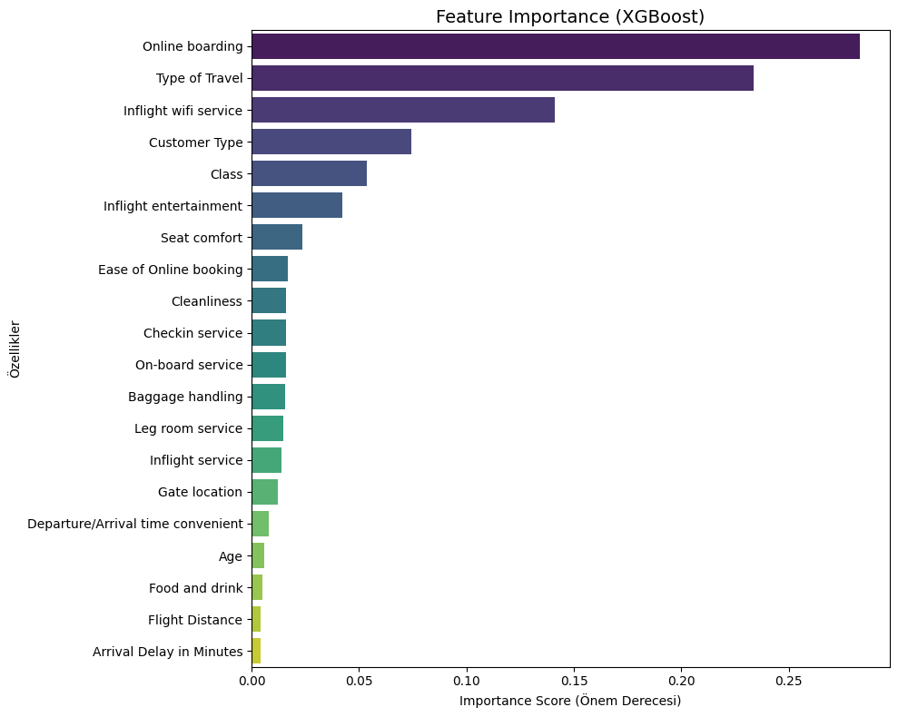

# Airline Passenger Satisfaction Prediction ✈️

## 1. Description of the Problem
This project aims to predict airline passenger satisfaction (Satisfied vs. Neutral/Dissatisfied) based on various service attributes and flight details. Understanding passenger satisfaction is crucial for airlines to minimize churn rates, improve service quality, and optimize operational costs. We approach this as a binary classification problem using advanced machine learning techniques.

## 2. Details of the Dataset and Preprocessing
**Dataset:** The complete dataset consists of **129,880 observations**. It is pre-split into a **Training Set of 103,904 entries** and a **Testing Set of 25,976 entries**.
* **Target Distribution:** The dataset is well-balanced with **56.7% Neutral/Dissatisfied** and **43.3% Satisfied** passengers, ensuring no significant class imbalance.



**Preprocessing Procedures:**
* **Handling Missing Values:** Missing values in the `Arrival Delay in Minutes` column were imputed using the **median** strategy to maintain data integrity.
* **Feature Selection:**
    * Irrelevant columns such as `id`, `Unnamed: 0`, and **`Gender`** were dropped to simplify the model.
    * `Departure Delay` was removed due to high multicollinearity (96%) with `Arrival Delay`.
* **Encoding:**
    * **Manual Mapping:** Applied to `Class` (Eco:0, Eco Plus:1, Business:2) and `satisfaction` (Neutral/Dissatisfied:0, Satisfied:1) to preserve ordinal meaning.
    * **Label Encoding:** Used for remaining categorical features (`Customer Type`, `Type of Travel`) to convert them into numeric format.

## 3. Model Details and Methodology
We evaluated multiple machine learning algorithms: **Logistic Regression, Random Forest, LightGBM, CatBoost, and XGBoost**.

**Experimental Approach (Feature Engineering Hypothesis):**
Before finalizing the model, we implemented a domain-driven feature aggregation strategy to reduce dimensionality. We hypothesized that grouping specific services into macro-categories would simplify the model without losing accuracy.

* **Constructed Features:**
    1.  **Digital Score:** Average of *Inflight Wifi, Online Booking, Online Boarding*.
    2.  **Comfort Score:** Average of *Food & Drink, Seat Comfort, Entertainment, Leg Room, Cleanliness*.
    3.  **Staff Score:** Average of *Gate Location, On-board Service, Check-in, Baggage Handling*.
* **Experiment Result:** The model trained on these 3 composite scores (instead of the original 14 features) saw an accuracy drop from **96.45%** to **~92.00%**.
* **Conclusion:** The aggregation caused information loss. The model performs significantly better when it can access granular signals (e.g., distinguishing "Wifi" specifically from general "Digital" interaction). Therefore, the final model uses all original features.

**Optimization Strategy:**
We utilized **Optuna (Bayesian Optimization)** to efficiently search the hyperparameter space, maximizing model performance while managing computational resources.

## 4. Model Benchmarking & Selection (Performance Analysis)
Following the feedback regarding **Inference Time** during the project presentation, we conducted a comprehensive benchmark measuring Accuracy, Development Cost, and Real-Time Latency.

| Model | Accuracy | Optimization Time (s)  | Inference Latency (ms)  | Verdict |
| :--- | :--- | :--- | :--- | :--- |
| **XGBoost** | **96.45%** | **47.6 s** (Efficient) | **0.0042 ms** (Real-Time) | **🏆 SELECTED** |
| **CatBoost** | 96.40% | 200.7 s (High Cost) | **0.0007 ms** (Fastest) | Too slow to optimize |
| **LightGBM** | 96.36% | 61.2 s  | 0.0047 ms | Lower Accuracy than XGB |
| **Random Forest**| 96.33% | 65.0 s | 0.0058 ms | Slowest Inference |
| **Logistic Reg.**| 87.21% | 6.7 s  | 0.0005 ms | Underfitting (Low Accuracy) |

### 💡 Why XGBoost? (Discussion on Inference Time)
During our detailed analysis, we observed an important trade-off:
1.  **CatBoost's Latency:** CatBoost achieved the fastest inference speed (**0.0007 ms**) due to its symmetric tree structure.
2.  **The Training Bottleneck:** However, CatBoost's training and optimization process was **4x slower** than XGBoost.
3.  **Final Decision:** We selected **XGBoost** as the production model because it offers the optimal balance. It provides the highest **Accuracy (96.45%)** and a latency of **0.0042 ms**, which is computationally negligible for real-time applications, while being significantly faster to train/retrain than CatBoost.

## 5. Model Results & Visualizations

### Example Inference (Real-time Predictions) 🔍
To visualize the model's performance on individual passengers, we tested random samples from the unseen test set.



**Analysis of Sample:**
* The table above displays a random sample of 10 predictions.
* The model correctly classified **9 out of 10** passengers.
* **Error Analysis:** As seen in row 0 (Passenger ID 9408), the model predicted "Neutral/Dissatisfied" (0) while the actual status was "Satisfied" (1). Such occasional misclassifications are expected in stochastic models, yet the overall high accuracy (96.45%) remains robust for production use.

### Training Process (Learning Curve) 📉
The plot below demonstrates the model's learning progress over ~260 iterations.



**Analysis of the Curve:**
* **Rapid Convergence:** The model achieves significant loss reduction within the first 50 iterations.
* **No Overfitting:** The **Train Loss (Blue)** and **Test Loss (Orange)** curves descend in parallel and remain close throughout the training process. The absence of a divergence between the two lines confirms that the model generalizes well to unseen data and is not memorizing the training set.

### Feature Importance & SHAP Analysis 🧠
To go beyond simple feature importance, we utilized **SHAP (SHapley Additive exPlanations)** values to understand the *direction* and *magnitude* of each feature's impact on passenger satisfaction.



**Key Insights from the Plot:**
* **Top Driver - Type of Travel:** The most influential factor is `Type of Travel`. As seen in the plot, high values (pink/red) strongly correlate with satisfaction, indicating that Business travelers are easier to satisfy or generally happier than Personal travelers.
* **The "Wifi" Factor:** `Inflight wifi service` is the second most critical feature. High values (red dots) pull strongly to the right (positive impact), confirming that connectivity is a major satisfaction driver.
* **Negligible Impact of Catering:** Features like `Food and drink` are located at the very bottom with values clustered around zero. This scientifically proves that catering quality has minimal impact on the final satisfaction decision compared to digital services.

### Confusion Matrix
The model demonstrates balanced performance with high True Positive (10783) and True Negative (14276) rates, ensuring that both satisfied and dissatisfied customers are accurately identified.



### Feature Importance (XGBoost Built-in)
Consistent with SHAP analysis, the built-in importance plot highlights **"Online boarding"** as the dominant feature, reinforcing the importance of the digital check-in experience.



## 6. Business Insights & Recommendations
Based on the model's findings (SHAP values & Feature Importance), we propose the following strategies:

1.  **Adopt a "Digital First" Strategy:** Wifi & Online Boarding impact satisfaction more than physical comfort. Airlines should prioritize IT infrastructure investments over seat upgrades.
2.  **Focus on "Personal Travelers":** Unlike business travelers, leisure travelers show a higher churn risk. Targeted loyalty campaigns should be launched specifically for personal travel.
3.  **Optimize Budget Allocation:** "Food and Drink" has negligible impact on passenger decisions. Catering budgets can be optimized to reallocate funds toward improving connectivity and digital services.

## 7. Instructions for Execution

### Environment
- Python 3.10

### Prerequisites
Install the required libraries using the provided requirements file:
```bash
pip install -r requirements.txt
```

### Running The Project
Open the `main.ipynb` file.

Execute all cells sequentially from top to bottom.

The notebook performs data preprocessing, model training, evaluation, and visualization.